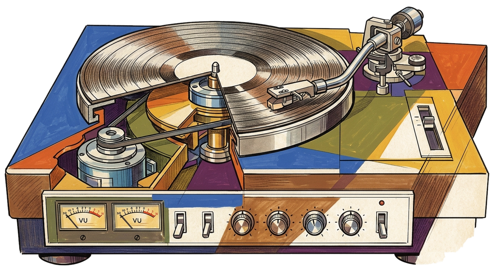

<p align="center">
  
</p>

<p align="center">
  <strong>A macOS menu bar companion for Last.fm.</strong><br>
  Live scrobbles, album discovery, library browsing, listening stats, and shareable collages in one fast local app.
</p>

<p align="center">
  
  
  
  
  
</p>

<p align="center">
  <a href="https://github.com/jeanluciradukunda/scrobble-now/releases/latest">Download latest release</a>
  &nbsp;|&nbsp;
  <a href="https://jeanluciradukunda.github.io/scrobble-now/">Visit the site</a>
</p>

<p align="center">
  
</p>

## What it is

Scrobble Now sits in your menu bar and keeps your listening history one click away. It reads your Last.fm profile, surfaces the track you are listening to right now, lets you drill into album metadata from five different music sources, and turns the same history into charts and collage exports that are easy to share.

It is built for people who already scrobble everything and want that data to feel alive instead of buried in a browser tab.

## Feature set

<table>
  <tr>
    <td width="33%" valign="top">
      <strong>Live feed</strong><br>
      Polls Last.fm every 15 seconds and shows now playing state, artwork, loved tracks, and your recent scrobble stream directly from the menu bar.
    </td>
    <td width="33%" valign="top">
      <strong>Album discovery</strong><br>
      Queries Last.fm, Discogs, MusicBrainz, iTunes, and Wikidata in parallel, then scores and merges results into a single album detail view.
    </td>
    <td width="33%" valign="top">
      <strong>Library browser</strong><br>
      Flip between top albums and top artists across time ranges and jump straight from the library into album discovery.
    </td>
  </tr>
  <tr>
    <td width="33%" valign="top">
      <strong>Collage generator</strong><br>
      Build topsters-style album grids from 3x3 to 10x10, toggle titles, then export as high-resolution PNG or copy to clipboard.
    </td>
    <td width="33%" valign="top">
      <strong>Listening history</strong><br>
      Browse day-grouped scrobbles with timestamps, artwork thumbnails, loved indicators, and quick links back into album detail.
    </td>
    <td width="33%" valign="top">
      <strong>Statistics</strong><br>
      Track total scrobbles, today, this week, top artists, genre breakdowns, and account history in a compact dashboard.
    </td>
  </tr>
</table>

## Why it feels good

- It lives in the menu bar, so your listening data is available without changing your workflow.
- It merges multiple music databases into one answer instead of forcing you to compare tabs by hand.
- It stays local to your Mac apart from the API calls needed to fetch music metadata.
- It includes a companion landing page in `site/` so the app and its presentation can evolve together.

## Quick start

### Install a release

1. Download the latest DMG from [Releases](https://github.com/jeanluciradukunda/scrobble-now/releases/latest).
2. Open the DMG and drag Scrobble Now to Applications.
3. Launch Scrobble Now and enter your Last.fm username in settings.

> Signed and notarized with Apple Developer ID — no security warnings or Terminal commands needed.

### Build from source

1. Use macOS 14+ and Xcode 16+.
2. Create your local secrets file:

```bash
cp ScrobbleNow/Resources/Secrets.example.plist ScrobbleNow/Resources/Secrets.plist
```

3. Fill in the values in `ScrobbleNow/Resources/Secrets.plist`.
4. Open `ScrobbleNow.xcodeproj` in Xcode and run the `ScrobbleNow` target.

If you ever regenerate the Xcode project from `project.yml`, use `xcodegen generate`.

<details>
  <summary><strong>API keys</strong></summary>

  <br>

  - Required: `LASTFM_API_KEY`, `LASTFM_SHARED_SECRET`
  - Optional: `DISCOGS_TOKEN`
  - No key required: MusicBrainz, iTunes Search API, Wikidata
  - `ScrobbleNow/Resources/Secrets.plist` is ignored by git and should stay local

</details>

## Develop the landing page

The marketing site is a separate SolidJS app under `site/`.

```bash
cd site
pnpm install
pnpm dev
```

Useful commands:

- `pnpm build` builds the static site
- `pnpm preview` previews the production build locally
- `pnpm typecheck` runs TypeScript checks

## Repo map

```text
ScrobbleNow/                 macOS app source
ScrobbleNow/Services/        API clients and caching
ScrobbleNow/Views/           Menu bar UI, detail views, stats, collage tools
ScrobbleNow/Resources/       plist files, entitlements, app assets
site/                        SolidJS landing page
tools/illustrations/         artwork generation and cleanup scripts
project.yml                  XcodeGen project spec
```

## Privacy

Scrobble Now does not ship analytics, cloud sync, or telemetry. It fetches data from public music APIs, caches what it needs locally, and keeps the rest on your machine.

## License

Released under the [MIT License](LICENSE).
